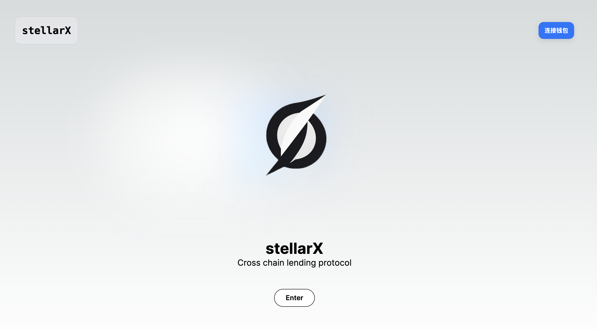

# StellarX

## 项目提交信息
项目名称

1. 项目名称 : StellarX 基于[CCIP](https://docs.chain.link/ccip)的双边利率优化跨链借贷协议
2. 所选赛道 : Public Goods
3. 项目图片

    

4. 简介

    StellarX是基于[CCIP](https://docs.chain.link/ccip)的双边利率优化跨链借贷协议。我们使用ChainLink的CCIP来进行链间的消息以及Token的通信，创新自研了双边利率优化算法模型，利用P2P撮合使存款人的收益率更高，借款人的利率更低。我们整合了多个链的借贷协议池流动性，使用户可以在任意链存入Token，并一键在另一链借出Token。

5. 队长和队员

    队长 : [Harlen009](https://github.com/beyond009)

    队员 : [Xun勋](https://github.com/xiaoyuanxun) , [0xNan](https://github.com/zn66665)

6. 本项目在这次黑客松的目标

    完成MVP的构建，能够实现存入资产、跨链借贷、资产清算。

7. 黑客松前两日的进度

    第一天进度 : 项目idea讨论确定，讨论研究双边利率优化算法模型，调研CCIP的使用，前端框架搭建，初步构建借贷合约和CCIP通信合约。

    第二天进度 : 完成借贷合约和CCIP通信合约，合约测试与部署，前后端对接。

8. Demo 视频链接 : 
    

9. 项目 github repo 链接

    合约 : https://github.com/xiaoyuanxun/StellarX

    前端 : https://github.com/beyond009/stellarX
    
10. 该项目是本次hackathon期间，从0到1开发的项目，完全原创
11. 项目 Demo 链接 : https://stellar-x-three.vercel.app/

